# Early-Exiting AMC with TAD Denoiser and SNR Predictor

This project extends an **Automatic Modulation Classification (AMC)** framework which excelled at **high-SNR** signal classification using **early exiting** \[1\]. However, its accuracy at **low-SNR** levels remained poor. To resolve this, we **iteratively developed** a **Threshold Autoencoder Denoiser (TAD)** and integrated a **lightweight SNR Predictor** into the baseline model. This ensures **efficiency** on **small-scale devices** while boosting **low-SNR** performance. 

> **Note**: A comprehensive PDF paper detailing the entire methodology and results is also available for in-depth reading.

---

## 1. Introduction

Over the last decade, **Automatic Modulation Classification (AMC)** has become increasingly important for wireless tasks like interference detection, dynamic spectrum access, and radar systems. Traditional AMC can be **feature-based (FB)** or **likelihood-based (LB)**, but modern **deep-learning-based** AMC offers powerful results at the cost of higher compute resources.

### Early-Exiting Motivation
- **High-SNR Success**: Prior work \[1\] showed **early exits** reduce computation time for strong signals that are confidently classified in shallow layers of a neural network.  
- **Shortfall at Low SNR**: The same approach struggled with signals \(\leq 0\) dB, rarely exiting early and still suffering from poor accuracy.

---

## 2. Proposed Design

To address **low-SNR** challenges while retaining **high-SNR** efficiency, our enhancements include:

1. **TAD Denoiser** \[2\]: A threshold-based autoencoder that filters noise.  
2. **SNR Predictor**: A small regression model that triggers denoising only when necessary.  
3. **Retained Early Exiting**: High-SNR signals can still exit early with minimal overhead.

### Figure 1: High-Level Design of AMC with a TAD-Denoiser
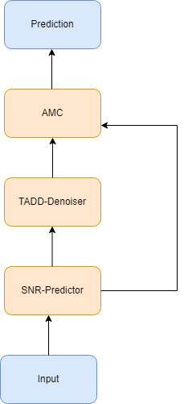

This diagram shows how the SNR Predictor and TAD interact before the AMC classifier, ensuring that only low-SNR signals are denoised.

---

## 3. Technical Explanations

### 3.1 TAD Denoiser
- **Architecture**: Implemented in `auto_coder_denoise(...)` as an encoder-decoder pipeline with **Conv2D** layers and thresholding.  
- **Threshold Logic**:  
  1. **Batch Normalization** for stable activations.  
  2. **Encoder** compresses features.  
  3. **Soft-Thresholding** subtracts a learned threshold from the absolute feature maps, clamping negatives to zero.  
  4. **Decoder** reconstructs the now-denoised signal.  
- **Benefit**: Removes low-magnitude noise, crucial for improving classification at SNRs below 0 dB.

### 3.2 SNR Predictor
- **Purpose**: Distinguish whether the incoming signal is noisy or clean.  
- **Implementation**: A small feed-forward network (2–3 Dense layers + Dropout) that outputs a single continuous SNR estimate.  
- **Gating**: If the predicted SNR \(\le 5\) dB (configurable), the signal is routed through TAD; otherwise, it bypasses denoising.

### 3.3 ML Techniques
1. **Loss Functions**:
   - **Categorical Cross-Entropy** for AMC classification.  
   - **Mean Absolute Error (MAE)** or **MSE** for the SNR regression.  
2. **Optimizer**:  
   - **Adam** with a typical \(\text{lr}=0.001\).  
3. **Regularization**:  
   - Dropout in the SNR Predictor to avoid overfitting.  
   - Occasional Batch Normalization in TAD layers.  
4. **Stratified K-Fold**:  
   - Ensures each fold is representative across modulations and SNR levels.  
5. **Early Stopping**:  
   - Monitors validation metrics to prevent overfitting or wasted epochs.

---

## 4. Implementation & Code Structure

The code resides in a single Jupyter Notebook with these main sections:

1. **Imports & Setup**  
   - Uses TensorFlow/Keras for building networks.  
2. **Data Loading**  
   - Loads RML datasets (2016a, 2016b, 2022), each containing multi-SNR signals.  
3. **Standalone TAD-CNN**  
   - First tested the TAD Denoiser with a CNN classifier to confirm low-SNR improvements.  
4. **SNR Predictor**  
   - Lightweight model that outputs a continuous SNR value.  
5. **Integrated Early-Exit AMC**  
   - Combines the original early-exit logic \[1\] with TAD Denoising—selectively applied based on predicted SNR.  
6. **Training & Evaluation**  
   - Applies **Stratified K-Fold** cross-validation.  
   - Reports accuracy vs. SNR, confusion matrices, speed tests, and more.

---

## 5. Results

### 5.1 Accuracy vs. SNR (Standalone TAD-CNN)

#### Figure 2: Accuracy vs SNR RML 2022
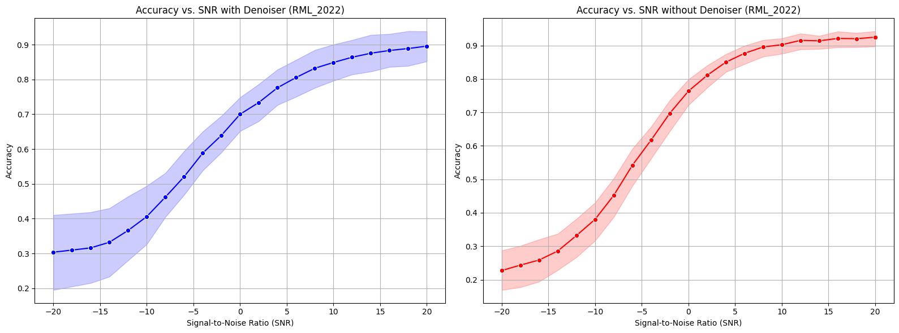

#### Figure 3: Accuracy vs SNR RML 2016a
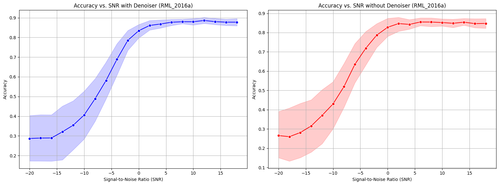

#### Figure 4: Accuracy vs SNR RML 2016b
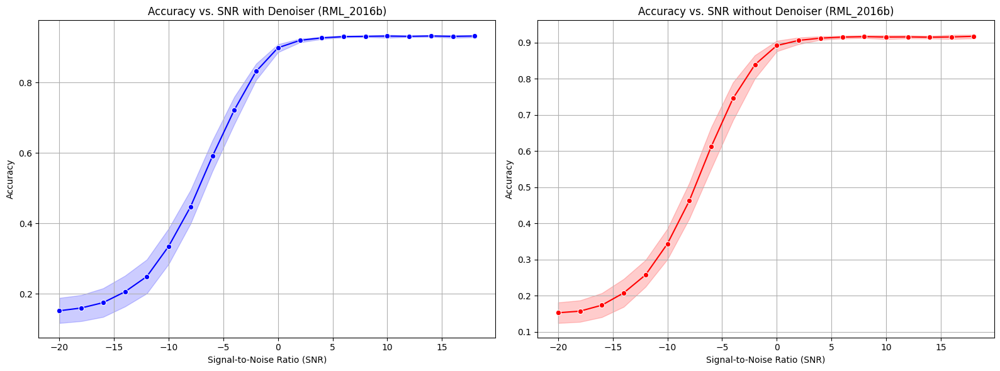

**Observation**: TAD-CNN boosts performance significantly below 0 dB. Denoising can slightly degrade high-SNR signals if always active.

### 5.2 Box Plot Analysis
We compared TAD vs. no-denoise across multiple folds:

#### Figure 5: Accuracy vs SNR RML 2022 (Box Plot)
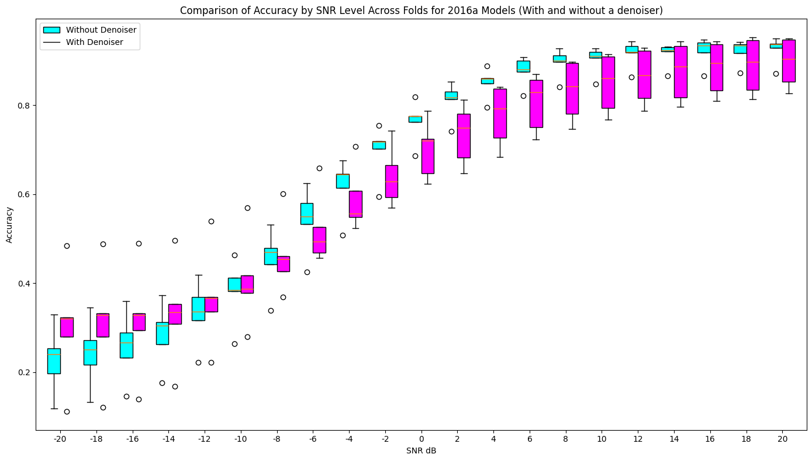

#### Figure 6: Accuracy vs SNR RML 2016a (Box Plot)
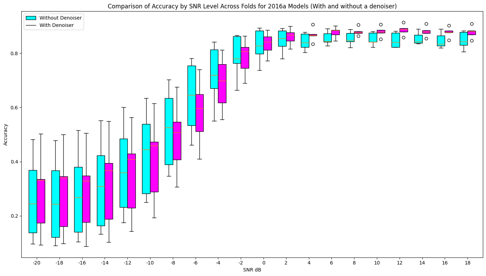

#### Figure 7: Accuracy vs SNR RML 2016b (Box Plot)
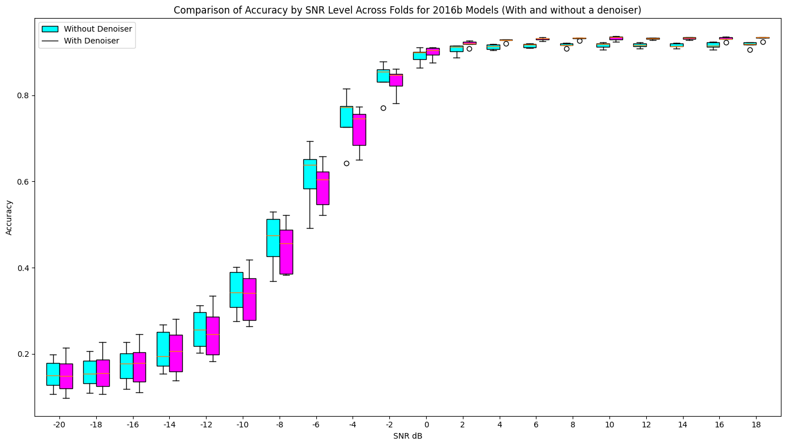

**Observation**: TAD-based models show lower variance in low-SNR ranges, but risk “over-denoising” at high SNR.

### 5.3 SNR Predictor Performance

#### Figure 8: Initial SNR Predictor Design
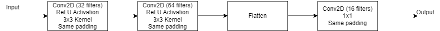

#### Figure 9: Initial SNR Predictor Design Results
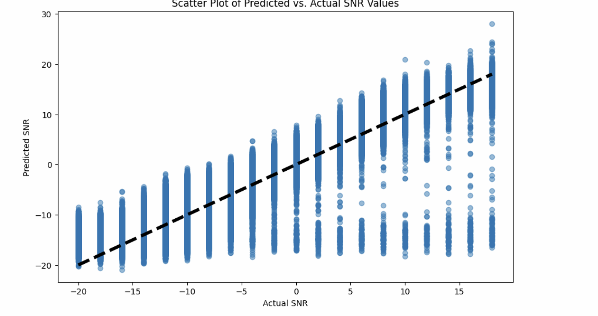

**Observation**: The predictor performs reasonably well except at extreme SNRs, but is sufficient for gating.

### 5.4 Merging SNR Predictor + TAD-CNN + Early Exiting

#### Figure 10: MAE SNR Predictor
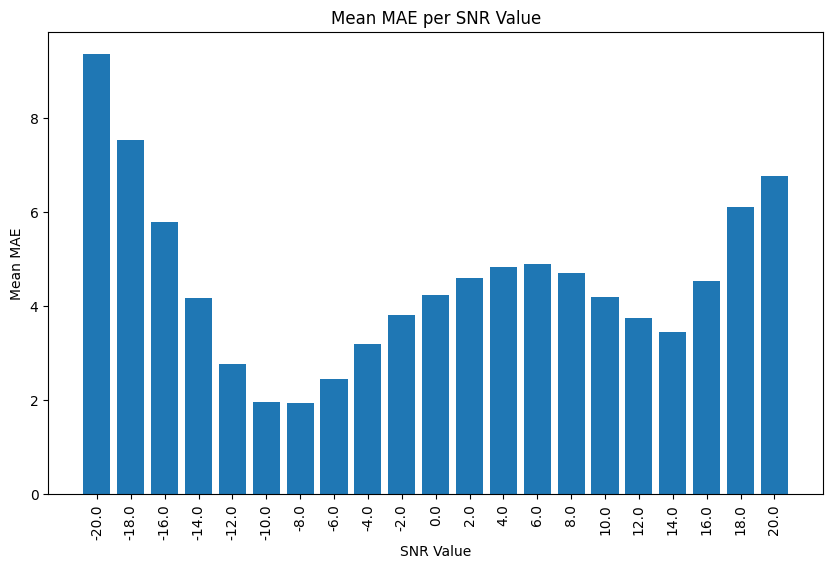

#### Figure 11: MAE of Fold SNR Predictor
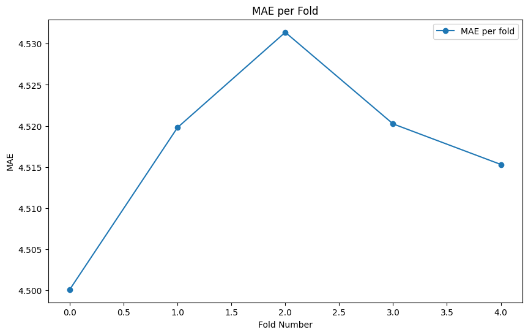

**Observation**: The mean absolute error (MAE) remains manageable for gating at ~5 dB.

#### Figures 12, 13, and 14: Accuracy vs. SNR (SNR_PRED_VS_DENOISER)
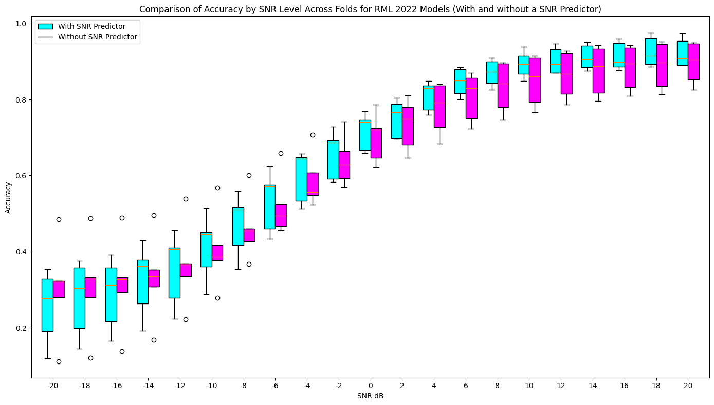  
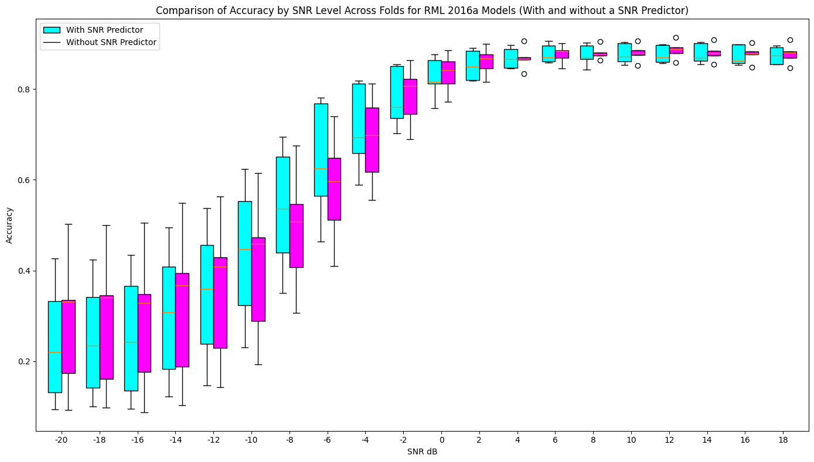  
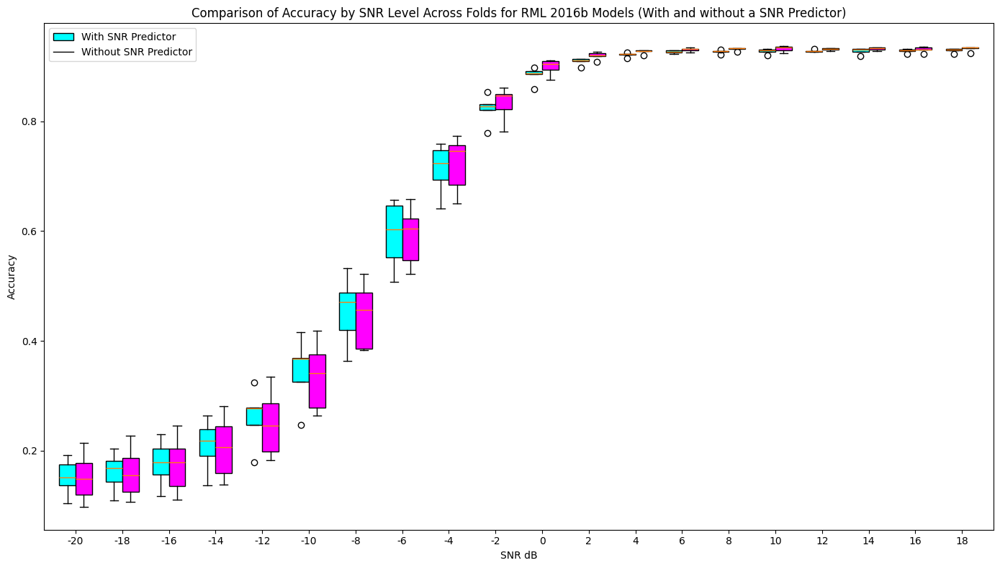

**Observation**: Low-SNR signals receive TAD denoising, improving accuracy. High-SNR signals bypass TAD.

### 5.5 Final Comparisons: No Denoiser vs. Always Denoiser vs. Conditional

#### Figures 15, 16, and 17: Accuracy vs. SNR (SNR_PRED_VS_TAD_DENOISER_VS_NODENOISER)
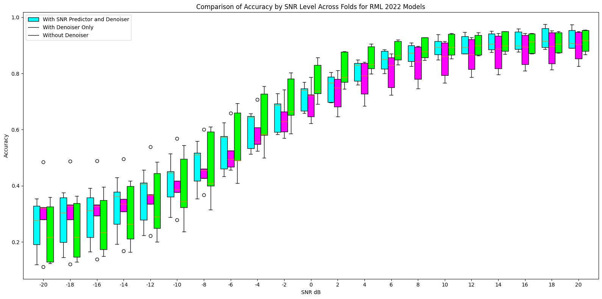  
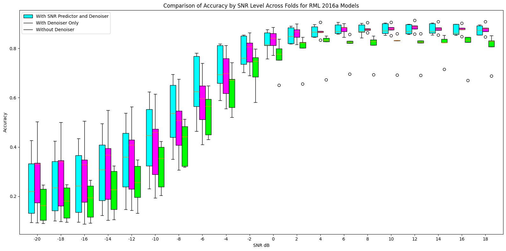  
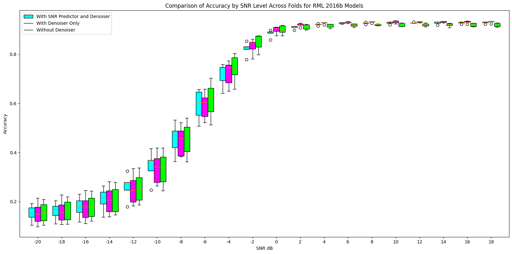

**Observation**: Conditional TAD solves low-SNR issues while preserving high-SNR speed.

---

## 6. Conclusion

By integrating a **selective TAD Denoiser** (triggered by an **SNR Predictor**) into the **early-exit** AMC model, we address the **weakness** at low SNR while preserving **efficiency** at high SNR. This approach is well-suited for **small-scale devices**, as it balances denoising overhead against potential gains in accuracy.

---

## 7. Future Work

1. **Adaptive Thresholding**: Dynamically adjust the denoising threshold based on the distribution of predicted SNRs.  
2. **Enhanced SNR Predictor**: Improve estimation at extreme (very high/low) SNR values to further reduce gating errors.  
3. **Real-World SDR Testing**: Validate performance with actual hardware and time-varying channels.

---

## 8. References

\[1\] **Elsayed Mohammed, Omar Mashaal, and Hatem Abou Zeid**. *Using Early Exits for Fast Inference in Automatic Modulation Classification*. arXiv preprint arXiv:2308.11100, 2023.

\[2\] **To Truong An and Byung Moo Lee**. *Robust Automatic Modulation Classification in Low Signal to Noise Ratio*. IEEE Access, 11:7860–7872, 2023.

> A comprehensive **PDF version** of this paper is also available for **further reading**.
